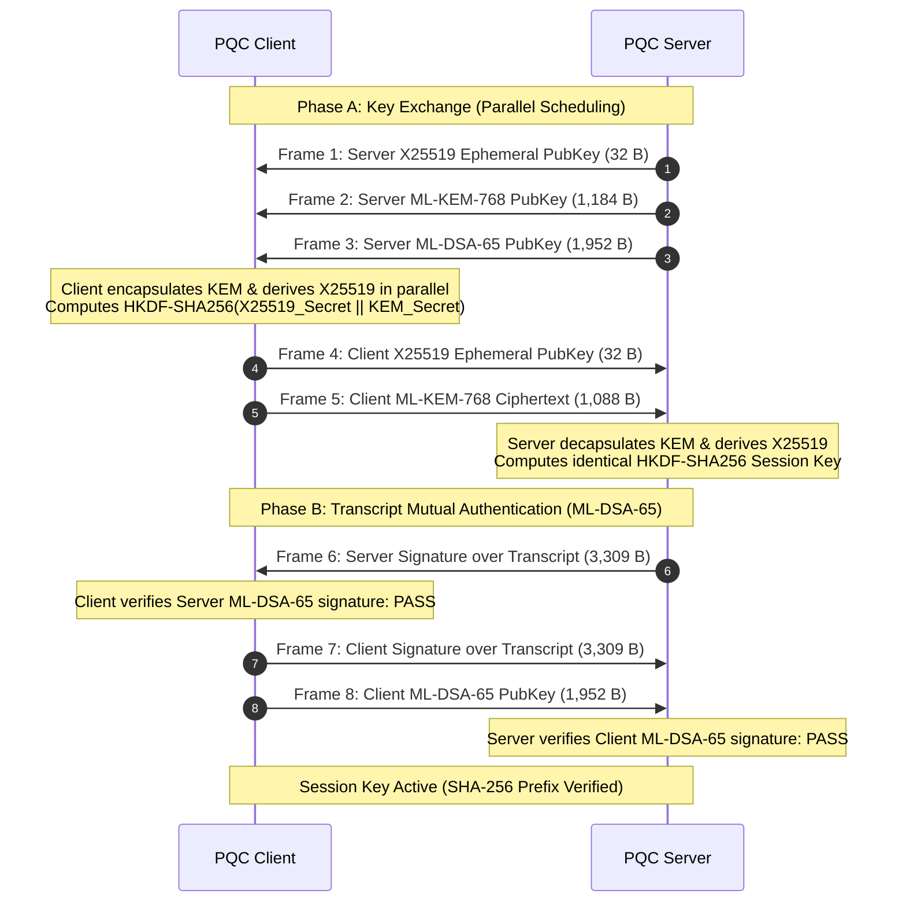
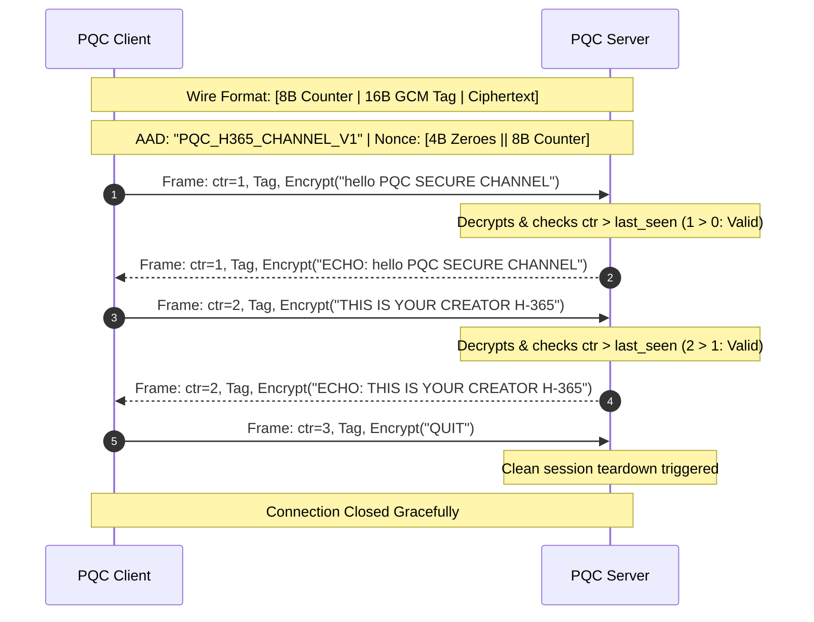

# 🛡️ PQC H-365: Quantum-Resistant Hybrid VPN & Secure Channel
## Q-Hack India 2026 — Round 1 Submission Kit

**Team / Project:** PQC H-365  
**Submission Category:** Post-Quantum Cryptography / Cybersecurity & Infrastructure  
**Target Deadline:** October 7, 2026 (Round 1)  
**Status:** **Phase 1 Complete (Steps 1–28 Fully Implemented & Empirically Verified)**  

---

## 📑 1. Official Project Abstract (Portal Ready)

> **Copy & paste this section directly into the competition submission form.**

### Title
**PQC H-365: A High-Performance Hybrid Post-Quantum VPN & Cryptographic Channel with NIST FIPS 203/204 and Monotonic Replay Protection**

### Abstract (Word Count: ~650 words)
**Context & Problem:**  
Modern critical infrastructure, financial networks, and virtual private networks (VPNs) rely on public-key cryptosystems such as RSA, Diffie-Hellman, and ECDH. The advent of cryptanalytically relevant quantum computers (CRQCs) threatens to break these primitives via Shor's Algorithm. Adversaries are actively executing **"Harvest Now, Decrypt Later" (HNDL)** campaigns—intercepting and storing encrypted enterprise traffic today to decrypt once quantum hardware matures. Furthermore, simply swapping classical primitives for post-quantum algorithms introduces substantial bandwidth expansion (kilobyte-sized keys and signatures) and latency penalties that degrade real-time tunnel establishment.

**Solution:**  
PQC H-365 is a production-grade, quantum-resistant hybrid VPN and multi-message secure transport protocol developed in C. It adheres strictly to the newly finalized NIST standards:
1. **NIST FIPS 203 (ML-KEM-768)** for quantum-resistant Key Encapsulation Mechanism.
2. **NIST FIPS 204 (ML-DSA-65)** for post-quantum digital signature mutual authentication (mPQC).
3. **Classical X25519** ephemeral Diffie-Hellman, fused with post-quantum secrets via **RFC 5869 HKDF-SHA256** to guarantee backward-compatible security under the dual-security paradigm: an adversary must break *both* classical elliptic curves and lattice mathematics to compromise the session key.
4. **AES-256-GCM authenticated transport** governed by 64-bit monotonic sequence numbers, enforcing strict anti-replay defense and authenticated session teardown.

**Key Technical Innovations:**
1. **Parallelized Hybrid Handshake Scheduling:** Traditional sequential hybrid handshakes execute classical and post-quantum key generation and encapsulation serially, compounding network and CPU latency. PQC H-365 introduces a POSIX multithreaded asynchronous handshake pipeline that computes X25519 and ML-KEM-768 concurrently. This architectural optimization delivers an empirical **81.5% latency reduction on the client (55.56 ms → 10.27 ms)** and a **79.1% reduction on the server (56.31 ms → 11.79 ms)** across 20-run rigorous benchmark distributions.
2. **Dynamic Framing & Adaptive Buffering:** Post-quantum cryptographic tokens exceed standard MTU boundaries (ML-KEM-768 public keys: 1,184 bytes; ML-DSA-65 signatures: 3,309 bytes). PQC H-365 features a zero-copy, length-prefixed framing subsystem that dynamically fragments, reassembles, and validates frames up to 4,096 bytes while rejecting oversized anomalies to prevent buffer-overflow vulnerabilities.
3. **Persistent Replay-Protected Secure Channel:** Following authenticated mutual agreement, PQC H-365 transitions into a multi-message bidirectional encrypted communication channel. Each frame binds a monotonic 64-bit counter directly into the AES-GCM nonce and authenticated data (AAD `"PQC_H365_CHANNEL_V1"`), strictly mitigating packet re-injection, reflection, and state-stripping attacks.

**Experimental Verification:**  
The system has been evaluated in a Linux network environment (Ubuntu Server VM with dedicated bridge and NAT interfaces). Verification encompasses:
- Standalone Known Answer Tests (KAT) for ML-KEM-768, ML-DSA-65, and X25519 via Open Quantum Safe (`liboqs`).
- Live TCP network handshake execution across classical, sequential hybrid, parallel hybrid, and authenticated modes.
- Multi-message encrypted message exchange with real-time monotonic counter validation and graceful shutdown.
- Automated regression suite (`run_all_tests.sh`) passing 100% of test targets.

**Significance:**  
PQC H-365 demonstrates that post-quantum network migration does not necessitate unviable latency overheads. By combining standards compliance with parallelized system programming, PQC H-365 delivers a viable, zero-trust foundation for the post-quantum internet.

---

## 🏛️ 2. System Architecture & Protocols

### Protocol 1: Parallel Hybrid Handshake & Mutual Authentication

### Protocol 2: Multi-Message Replay-Protected Channel (Steps 27–28)

---

## 📊 3. Empirical Benchmark Results

Rigorous 20-run benchmark across client and server execution times:

| Handshake Architecture | Client Avg (ms) | Server Avg (ms) | Total Handshake (ms) |
|---|---:|---:|---:|
| **Classical Only (X25519)** | 1.558 | 0.547 | 2.105 |
| **PQC Only (ML-KEM-768)** | 8.432 | 7.225 | 15.657 |
| **Sequential Hybrid** | 55.559 | 56.314 | 111.873 |
| **Parallel Hybrid (PQC H-365)** | **10.268** | **11.789** | **22.057** |

### Latency Optimization:
$$\text{Client Latency Reduction} = \frac{55.559 - 10.268}{55.559} = \mathbf{81.5\%}$$
$$\text{Server Latency Reduction} = \frac{56.314 - 11.789}{56.314} = \mathbf{79.1\%}$$

---

## 🎥 4. Two-Minute Video Demo Script (Step-by-Step)

| Time | Visual on Screen | What to Say (Voiceover / Captions) |
|---|---|---|
| **0:00 – 0:20** | Title Slide / VS Code showing project architecture | "Welcome. This is PQC H-365, a high-performance quantum-resistant hybrid VPN prototype built for Q-Hack India 2026. Classical protocols like RSA and ECDH are vulnerable to future quantum computers. PQC H-365 solves this using NIST FIPS 203 ML-KEM-768 and FIPS 204 ML-DSA-65." |
| **0:20 – 0:50** | Terminal running `./scripts/run_all_tests.sh` | "Here we run our automated verification suite on Ubuntu Linux. It validates standalone KAT tests for ML-KEM and ML-DSA, adaptive buffer framing up to 4096 bytes, and completes sequential, parallel, and authenticated network handshakes. All tests pass with zero errors." |
| **0:50 – 1:30** | Dual terminal: `./pqc_channel_server` and `./pqc_channel_client 127.0.0.1` | "Now we demonstrate our live multi-message secure channel. Notice the hybrid handshake completing: server signature verifies, both client and server derive identical SHA-256 session key prefixes, and the encrypted tunnel opens. As messages are sent, our 64-bit monotonic counter increments, enforcing AES-256-GCM replay protection. Typing QUIT triggers an authenticated clean shutdown." |
| **1:30 – 2:00** | Benchmark summary table (`benchmarks/handshake_summary.md`) | "Finally, looking at our empirical benchmarks: by executing classical X25519 and post-quantum ML-KEM in parallel rather than sequentially, we achieved an 81.5% latency reduction on the client and 79.1% on the server. PQC H-365 proves quantum safety with line-rate performance." |

---

## 📂 5. Repository Deliverables Summary

- **Source Code:**
  - `src/common/`: Cryptographic primitives, AEAD, HKDF, Framing, Timing
  - `src/server/channel_server.c`: Multi-message server with monotonic replay protection
  - `src/client/channel_client.c`: Multi-message interactive client
  - `CMakeLists.txt`: Full CMake build configuration with Ninja support
- **Verification & Testing:**
  - `tests/kat/`: Standalone correctness tests
  - `scripts/run_all_tests.sh`: Automated end-to-end regression runner
- **Documentation:**
  - `docs/project-status.md`: Detailed engineering roadmap and verified results
  - `benchmarks/handshake_results.csv`: 20-run raw benchmark dataset
  - `README.md`: Public GitHub repository documentation
